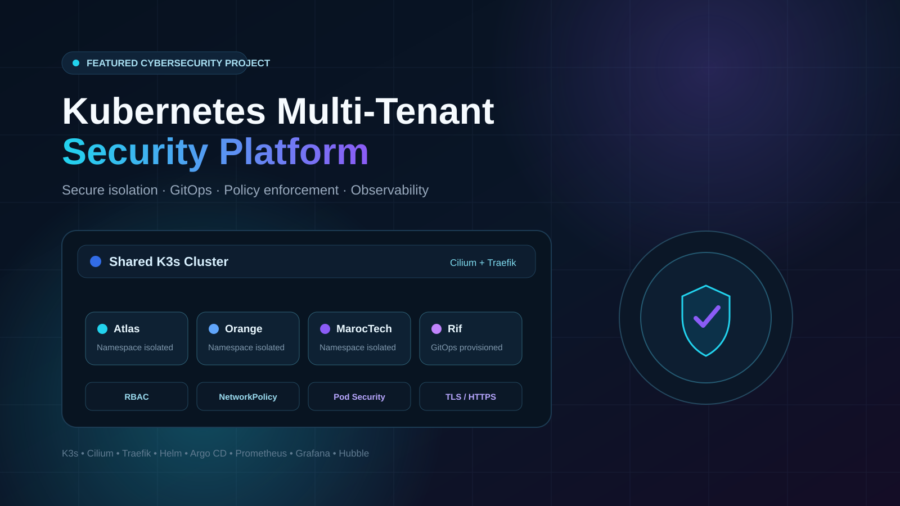
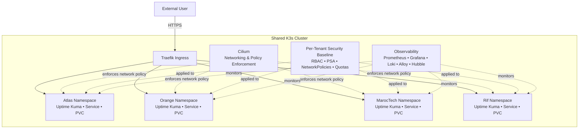
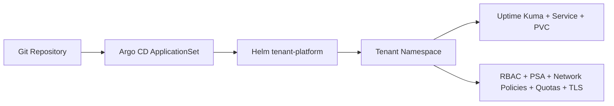
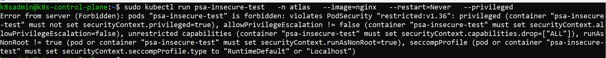
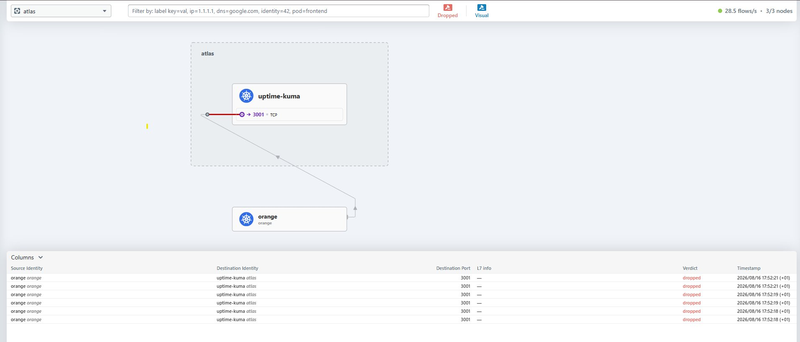
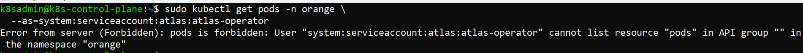
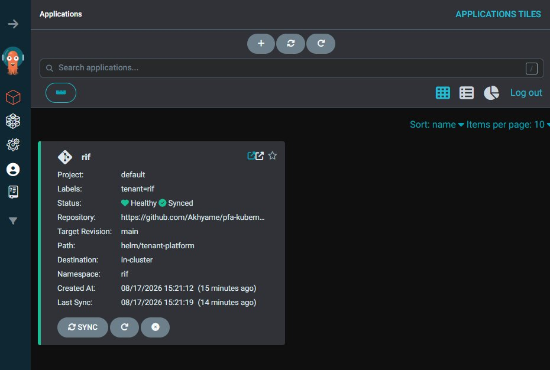
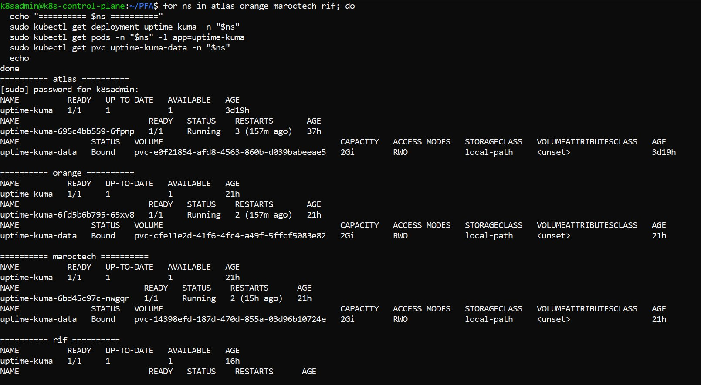

# Kubernetes Multi-Tenant Security Platform

> Secure Kubernetes multi-tenancy lab focused on tenant isolation, least privilege, policy enforcement, GitOps automation, and observability.



## Overview

This project designs and validates a secure multi-tenant Kubernetes platform for isolated **Uptime Kuma** environments running on shared infrastructure.

The validated lab environment contained four tenant namespaces: **Atlas, Orange, MarocTech, and Rif**.

The security model combines Kubernetes namespaces with network isolation, RBAC, Pod Security Admission, resource governance, TLS, persistent storage separation, GitOps, and centralized observability.

## Architecture

The architecture separates **runtime user traffic** from the **GitOps deployment and reconciliation workflow**.

### Runtime Traffic & Tenant Isolation



Runtime requests enter the cluster through **Traefik**, which routes traffic to the correct tenant. **Cilium** enforces network controls, while RBAC, Pod Security Admission, NetworkPolicies, quotas, and other tenant-specific controls provide layered isolation. Observability is provided through Prometheus, Grafana, Loki, Grafana Alloy, and Cilium Hubble.

### GitOps Deployment & Reconciliation



Git stores the desired tenant configuration. **Argo CD ApplicationSet** discovers and reconciles tenant definitions, while the reusable **Helm `tenant-platform` chart** applies the tenant workload and security baseline. **cert-manager** provides tenant TLS certificates using the private laboratory CA.

**Core components:** K3s, Cilium, Traefik, cert-manager, Helm, Argo CD, Prometheus, Grafana, Loki, Grafana Alloy, and Cilium Hubble.

## Security Controls

| Control | Purpose |
|---|---|
| Namespace isolation | Logical tenant separation |
| Default-deny NetworkPolicies | Block unauthorized ingress, egress, and cross-tenant traffic |
| CiliumNetworkPolicy | Allow only required workload-specific flows |
| RBAC | Enforce least-privilege Kubernetes API access |
| Dedicated ServiceAccounts | Reduce workload identity exposure |
| Pod Security Admission | Enforce the Restricted security profile |
| ResourceQuota + LimitRange | Limit tenant resource consumption |
| ClusterIP + Traefik | Keep workloads behind a controlled ingress path |
| TLS / HTTPS | Protect tenant web traffic |
| Dedicated PVCs | Separate and persist tenant application data |
| GitOps | Standardize tenant onboarding and reduce configuration drift |

## Security Validation

| Test | Result |
|---|---|
| Orange → Atlas application access | Blocked |
| Cross-tenant Kubernetes API access | `Forbidden` |
| Insecure privileged Pod | Rejected by Pod Security Admission |
| ResourceQuota / LimitRange violation | Rejected |
| Authorized Traefik → tenant workload | Allowed |
| Atlas HTTPS through Traefik | Validated |
| Pod recreation with persistent data | Data preserved |
| Required Uptime Kuma HTTP/HTTPS egress | Allowed |

## GitOps Workflow

```text
Git commit
   ↓
Argo CD ApplicationSet
   ↓
Helm tenant-platform
   ↓
Tenant namespace
   ↓
Uptime Kuma + Service + PVC
   ↓
RBAC + PSA + Network Policies + Quotas + TLS
```

The repository currently tracks GitOps tenant values for **MarocTech, Orange, and Rif** under `tenants/`.

## Repository Structure

```text
.
├── argocd/
│   └── tenant-applicationset.yaml
├── helm/
│   └── tenant-platform/
│       ├── Chart.yaml
│       ├── values.yaml
│       └── templates/
├── scripts/
│   └── tenantctl.sh
├── tenants/
│   ├── maroctech/
│   ├── orange/
│   └── rif/
└── .gitignore
```

- `argocd/` — Argo CD ApplicationSet used for GitOps reconciliation.
- `helm/tenant-platform/` — reusable tenant Helm chart.
- `tenants/` — tenant-specific GitOps values.
- `scripts/tenantctl.sh` — lab helper for tenant lifecycle operations.

### Tenant helper

```bash
./scripts/tenantctl.sh create <tenant-name> <hostname>
./scripts/tenantctl.sh suspend <tenant-name>
./scripts/tenantctl.sh resume <tenant-name>
./scripts/tenantctl.sh delete <tenant-name>
```

> The helper script contains lab-specific chart and K3s kubeconfig paths and must be adapted before reuse in another environment.

## Selected Evidence

The following screenshots provide direct evidence of the main security and automation controls validated in the lab. Additional technical evidence is available in the full project documentation and academic report.

### 1. Pod Security Admission Enforcement



A deliberately insecure workload was rejected by the namespace's **Restricted Pod Security** policy, confirming admission-level workload hardening.

### 2. Inter-Tenant Network Isolation



**Cilium Hubble** shows unauthorized traffic from Orange to Atlas being dropped, validating cross-tenant network isolation.

### 3. Cross-Tenant RBAC Denial



A tenant-scoped identity was denied access to resources in another namespace, confirming **least-privilege RBAC** and cross-tenant API isolation.

### 4. GitOps Tenant Provisioning



The Rif tenant was provisioned through the standardized **Git + Argo CD + Helm** workflow, validating reproducible GitOps onboarding.

### 5. Final Multi-Tenant Health Validation



Final validation confirms the expected tenant workloads are operational across the four isolated environments.

## Technologies

**Platform:** Kubernetes, K3s, Linux  
**Networking:** Cilium, Cilium Hubble, Traefik  
**Security:** RBAC, Pod Security Admission, NetworkPolicy, CiliumNetworkPolicy, ResourceQuota, LimitRange, TLS/HTTPS, K3s secrets encryption  
**Automation:** Helm, Git, Argo CD  
**Observability:** Prometheus, Grafana, Loki, Grafana Alloy, Hubble  
**Workload:** Uptime Kuma

## Key Design Decisions

Namespaces alone do not provide sufficient tenant security. The platform therefore uses layered controls for network access, API authorization, workload hardening, resource governance, ingress, storage, and lifecycle management.

GitOps was introduced to keep tenant configuration declarative, reproducible, and easier to reconcile.

## Limitations

This is a security-focused laboratory prototype rather than a production managed Kubernetes service.

- `local-path` storage is not highly available.
- TLS uses a private laboratory CA.
- The environment is local rather than cloud-hosted.
- GitOps bootstrap remains administrator-managed.
- Large-scale load and density testing were not performed.
- Disaster-recovery procedures were not fully validated.

## Future Improvements

- Cloud-managed Kubernetes deployment
- Highly available storage
- Production PKI and DNS
- Policy-as-code and CI security checks
- Backup and disaster-recovery automation
- Larger-scale tenant and performance testing

## Documentation

- **Portfolio project page:** coming with the public portfolio
- **Academic report:** available from the portfolio project page
- **Video demo:** coming soon
- **Repository:** https://github.com/Akhyame/pfa-kubernetes-multitenant

## Author

**Siham Akhyame**  
Cybersecurity Student | Hands-on Security Projects & Labs
